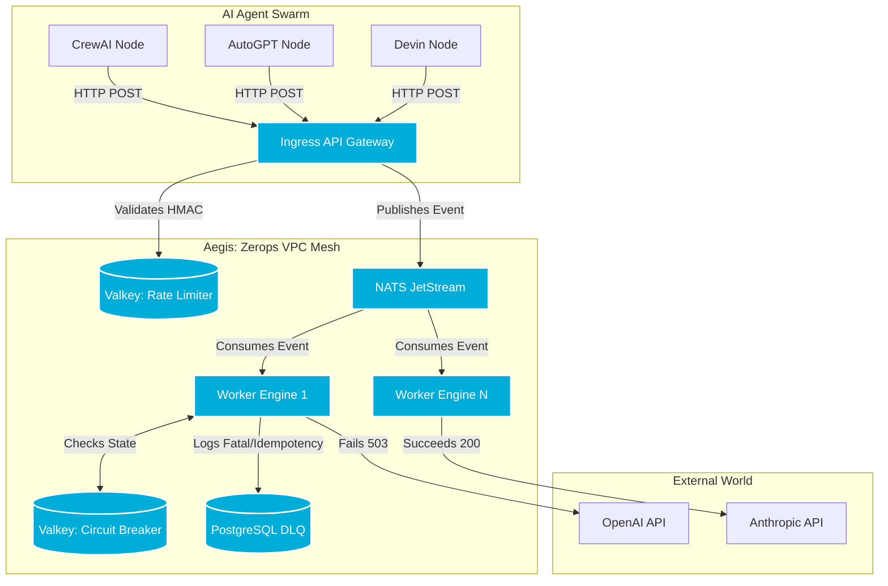

# Aegis: Resilience Layer for Multi-Agent Webhooks

[](https://zerops.io)
[](https://go.dev)
[](openapi.yaml)

## 📌 The Problem
As AI Agent orchestration (CrewAI, AutoGPT, etc.) scales, agents dispatch thousands of asynchronous webhooks to downstream LLM providers. When an API like OpenAI or Anthropic experiences a transient `503` outage or `429` rate limit, standard webhook architectures either drop the payloads permanently or mindlessly retry until they cause a self-inflicted DDOS attack.

**Aegis** is a distributed ingress gateway and worker mesh built natively for **Zerops**. It intercepts agent webhook traffic, enforces global rate limits, and uses distributed circuit breakers to protect downstream APIs, ensuring zero data loss during cloud outages.

## 🤖 Built with ZCP & AI Assistants
Aegis was architected alongside the **Zerops Control Plane (ZCP)** and AI coding agents (Claude 3.5 Sonnet). ZCP was instrumental in rapidly iterating the distributed topology—allowing the AI to write and refine the `zerops.yaml` to instantly provision a complex, 5-node VPC infrastructure without manual dev-ops friction. The repository contains native `.cursorrules` to ensure AI agents respect the HMAC security layer and JetStream invariants during autonomous maintenance.

## 🏗️ Core Architecture & Topology
Aegis does not run as a monolithic container. It leverages Zerops to deploy a true private mesh:
1. **Edge Gateway (Go):** Public-facing ingress. Validates HMAC signatures and enforces global rate-limiting.
2. **Worker Engine (Go):** Private, isolated container. Processes payloads and executes exponential backoff.
3. **Distributed Cache (Valkey):** Maintains the global Token-Bucket rate limit and the cross-worker Circuit Breaker state.
4. **Message Broker (NATS JetStream):** Provides at-least-once delivery guarantees. If a worker pod crashes, JetStream holds the payload for redelivery.
5. **Persistent State (PostgreSQL):** Enforces idempotency via unique constraints and stores fatal hallucinations in the Dead Letter Queue (DLQ).


## Live SRE Telemetry and Simulation
To make evaluating this architecture effortless, a live traffic simulator is built directly into the UI. No terminal is required to test the circuit breakers.

Navigate to the Aegis Control Plane deployed on Zerops: [INSERT_ZEROPS_LIVE_URL_HERE]

Authenticate using the Enterprise Admin Token (Check submission details for the secure token).

Click the purple "⚠️ Simulate AI Swarm Outage" button to inject concurrent agent payloads into the gateway.

Observe the Telemetry: The dashboard uses DOM-diffing to update in real-time. You will see healthy payloads clear the gateway, while simulated 503 Service Unavailable endpoints automatically trip the Valkey Circuit Breaker and cascade into the DLQ.

Click "🔄 Replay" on any DLQ event to securely re-queue it into NATS JetStream.

## ⚙️ Local Development & Testing
Aegis is built with rigorous security testing in mind. See openapi.yaml for the complete API contract.

```bash
# Run the Ingress Security Test Suite
go test ./internal/... -v

# Start Local Gateway & Worker (Requires local Postgres, Redis, NATS)
go run cmd/ingress/main.go
go run cmd/worker/main.go
```
